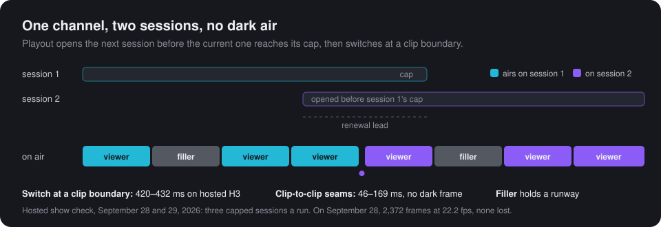

<div align="center">


# reactor-effect

**Build on [Reactor](https://reactor.inc)'s real-time video models with [Effect](https://effect.website).**<br />
Keep a channel on air across session caps, read decoded frames in Node without a browser,<br />
and run the whole application offline before it spends a cent.

[](https://www.npmjs.com/package/reactor-effect-client)
[](https://github.com/mannyc2/reactor-effect-client/actions/workflows/ci.yml)
[](https://mannyc2.github.io/reactor-effect-client/)
[](./LICENSE)

[Documentation](https://mannyc2.github.io/reactor-effect-client/) ·
[Quickstart](https://mannyc2.github.io/reactor-effect-client/start/quickstart/) ·
[Examples](#examples) ·
[Hosted evidence](https://mannyc2.github.io/reactor-effect-client/reference/hosted-evidence/) ·
[For coding agents](https://mannyc2.github.io/reactor-effect-client/reference/agents/)

</div>

<br />



## Try it in a minute, no API key

```sh
git clone https://github.com/mannyc2/reactor-effect-client && cd reactor-effect-client
bun install
node examples/quickstart/src/main.ts
```

That runs [one program](./examples/quickstart/src/main.ts) that asks H3 for a clip, follows it to
its end and decodes its frames in your process, on `ReactorTest`, Reactor simulated in memory at
the timing paid runs measured. Set `REACTOR_API_KEY` and the same program runs on hosted H3: only
the layer changes.

```ts
const firstClip = Effect.gen(function* () {
  const coordinator = yield* CoordinatorClient.CoordinatorClient;
  const reactor = yield* Reactor.Reactor;
  const session = yield* reactor.create({
    model: H3.modelName,
    tokens: coordinator.tokens({ modelName: H3.modelName, maxSessionDuration: "2 minutes" }),
  });
  const h3 = yield* H3.make(session);
  yield* h3.setAutoplay(true);
  const media = yield* session.decoded; // BGRA frames and PCM, in this process
  yield* media.video("main_video").pipe(
    Stream.runForEach((frame) => Console.log(`frame ${frame.width}x${frame.height}`)),
    Effect.forkScoped,
  );

  const submission = yield* h3.prepare({ prompt: "A paper boat on a rainy street", seconds: 5 });
  yield* submission.submit;
  const clip = yield* h3.operation(submission);
  yield* clip.reached("started");
  yield* clip.ended;
}).pipe(Effect.scoped);
```

## Why reactor-effect

- **Stay on air.** `Playout` is a keyed schedule of clips in priority lanes, with filler that holds
  a runway, deadlines, cues and edits. It renews sessions before their cap and switches at a clip
  boundary. On hosted H3, seams measured 46–169 ms with no dark frame, and a planned switch between
  sessions 420–432 ms.
- **Frames in Node and Bun, no browser.** `reactor-effect-native` binds libwebrtc through Node-API
  and hands your process owned BGRA frames and PCM, in process or in a child process per
  connection. Reactor's own TypeScript livestream starter launches headless Chromium to reach the
  media; this does not. On hosted H3: 1344×768 at about 24 fps, no frame lost.
- **Build and test offline.** `ReactorTest` speaks the real wire protocol in memory, with H3's
  timing measured on paid runs and 23 faults to inject, from a failed build to a lost reply or a
  moderation verdict. On `TestClock`, hours of programme run in milliseconds. CI never pays.
- **Know what reached Reactor.** Every failed command says whether it was never sent, answered, or
  unknown. An enqueue whose reply was lost is never sent again, so a lost reply never plays a clip
  twice.
- **Sessions outlive tokens and processes.** Tokens bound to a session refresh before they expire.
  A dropped connection recovers on the same session: on hosted H3 its picture was back 1.82 s after
  the drop. A crashed owner's session is adopted by the next process: 3.06 s after the kill.
- **Billing safety as an API.** Every creating token caps its session, `close` confirms termination
  with an independent read, and `Session.mayStillBill` names what may still be running. All 27 paid
  sessions in the hosted evidence ended with termination confirmed.

## Examples

| Example                                  | What it shows                                                                                                                                     | Without a key         |
| ---------------------------------------- | ------------------------------------------------------------------------------------------------------------------------------------------------- | --------------------- |
| [Quickstart](./examples/quickstart)      | One clip from prompt to its end, with its frames decoded, in one file                                                                             | runs on `ReactorTest` |
| [Terminal viewer](./examples/terminal)   | H3 drawn in your terminal from decoded frames: no browser anywhere                                                                                | runs on `ReactorTest` |
| [Live channel](./examples/livestream)    | Your own 24/7 AI channel: viewers prompt it, filler covers the gaps, sessions renew with no dark air, many browsers watch, optional RTMP restream | runs on `ReactorTest` |
| [H3 Studio](./packages/browser/examples) | A page that runs its own session over WebRTC: H3's queue live, references, each clip's lifecycle                                                  | runs in the browser   |
| [Capture](./packages/native/examples)    | A command line that writes a clip's decoded frames and audio to an MP4                                                                            | paid only             |
| [Rundown](./packages/client/examples)    | An application service over `Playout`, tested offline on the test clock                                                                           | runs on `ReactorTest` |

## Packages

| Package                                        | What it gives you                                                                                                         | Runs in                |
| ---------------------------------------------- | ------------------------------------------------------------------------------------------------------------------------- | ---------------------- |
| [`reactor-effect-client`](./packages/client)   | `Reactor` and `Session`, `CoordinatorClient` and tokens, `H3`, `Playout` with `H3Source` and `LocalSource`, `ReactorTest` | Node, Bun and browsers |
| [`reactor-effect-browser`](./packages/browser) | `BrowserPeer` on the browser's `RTCPeerConnection`, and `BrowserMedia` for the session's tracks                           | Browsers               |
| [`reactor-effect-native`](./packages/native)   | `NativePeer` on a libwebrtc Node-API addon, prebuilt for Linux x64 (glibc) and macOS on Apple silicon                     | Node and Bun           |

```sh
npm install --save-exact reactor-effect-client effect@4.0.0-rc.117
npm install --save-exact reactor-effect-native @effect/platform-node@4.0.0-rc.117   # Node and Bun
npm install --save-exact reactor-effect-browser                                     # browsers
```

Effect 4 is in release candidates, so every package pins it exactly.
[Installation](https://mannyc2.github.io/reactor-effect-client/start/installation/) covers the
details, and the [documentation](https://mannyc2.github.io/reactor-effect-client/) covers sessions,
H3, the playout, media, errors, testing and cost control.

## Measured on hosted Reactor

CI runs every check against `ReactorTest`. Hosted Reactor is exercised by paid checks the
maintainer runs with a budget, and each run keeps its evidence in
[`integration/hosted/evidence`](./integration/hosted/evidence).

| What                                                 | Measured                                                                 |
| ---------------------------------------------------- | ------------------------------------------------------------------------ |
| Video through the native host                        | 1344×768 at 23.7–24.3 fps, no frame lost                                 |
| Seams between clips on one session                   | 46–169 ms, no dark frame                                                 |
| A planned switch to a renewed session                | 420–432 ms                                                               |
| A dropped connection, recovered on the same session  | ready 1.64 s later, picture back at 1.82 s, nothing re-allocated         |
| A killed owner's session, adopted by another process | ready 3.06 s after the kill, the playing clip named, no command replayed |
| A session ended by moderation under the playout      | its ready clip aired on a replacement opened 3.17 s later                |

The [hosted evidence page](https://mannyc2.github.io/reactor-effect-client/reference/hosted-evidence/)
lists every run with its date, commit and spend, and what has not run on hosted Reactor yet.

## Status

reactor-effect is an independent project, not an official Reactor SDK. It supports H3 Reference
Turbo Realtime today. [Limits and support](https://mannyc2.github.io/reactor-effect-client/reference/limits/) says which
platforms it runs on and what has not been exercised on hosted Reactor yet. It is at 0.x, so a minor release can still change the API; the
[changelog](./CHANGELOG.md) says what changed and how to upgrade. Every version is published to npm
with provenance by the [release workflow](./.github/workflows/release.yml). Protocol material and
native WebRTC dependencies are attributed in [NOTICE](./NOTICE).

## Contributing

```sh
bun install --frozen-lockfile
bun run verify --profile portable
```

[CONTRIBUTING.md](./CONTRIBUTING.md) is how the repository works and how its code reads;
[scripts/README.md](./scripts/README.md) lists the verification profiles CI runs;
[SECURITY.md](./SECURITY.md) is for vulnerability reports. Licensed under [Apache-2.0](./LICENSE).
