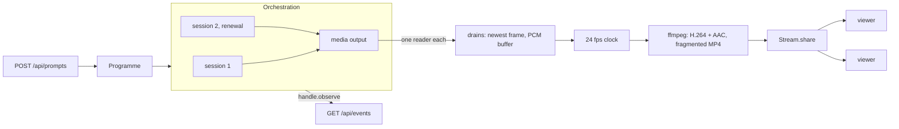

# Live channel

A server that runs one Reactor H3 orchestration and broadcasts it to any number of browsers. The server holds the API key, opens and renews the sessions, drains the decoded media, encodes it once and streams it to every viewer as fragmented MP4. Viewers send prompts to the server; they never talk to Reactor. By default it runs offline on the SDK's simulation, so it costs nothing to try.

It uses `reactor-effect-client` (orchestration, renewal, simulation, error reasons, evidence schemas) with `reactor-effect-native` (decoded frames and audio on the server, the isolated host), in an Effect application: services and layers, an `HttpApi` served by `@effect/platform-node`, `Stream.share` for fan-out and a child process for the encoder.

## Run it

Needs Node 22.18 or newer (it runs the TypeScript sources directly) and `ffmpeg` on `PATH`. From the repository root:

```sh
bun install
bun run build
cd examples/livestream
node src/main.ts            # http://127.0.0.1:3000
```

The page plays the channel and has a prompt box and an event log; `/docs` describes the API and `/openapi.json` is its OpenAPI document. Each simulated session lasts two minutes, so 75 seconds in the log shows its replacement opening (`renewal Opened`, `Prepared`), and once the first session has played what it holds, `renewal Switched`, while the video carries on.

### Live

```sh
CHANNEL_MODE=live REACTOR_API_KEY=… node src/main.ts
```

Live mode opens paid H3 sessions: it logs the model's rate first, then mints a token per session on the server and renews sessions before they expire. Each session is capped at `CHANNEL_SESSION_LENGTH` and at most `CHANNEL_MAX_SESSIONS` are opened. When the last one reaches its renewal point the orchestration is refused a replacement, fails after three attempts (about ten seconds later) and the channel goes off air; the server then closes that session at once rather than pay for it until it expires. Every session's owner record is written before it connects, and on shutdown (Ctrl-C) the sessions are terminated and the cleanup report is written. Live mode uses the isolated native host, which needs Node; the offline mode also runs on Bun.

| Variable                 | Default                        | Meaning                                                       |
| ------------------------ | ------------------------------ | ------------------------------------------------------------- |
| `CHANNEL_MODE`           | `simulated`                    | `simulated` (offline, unpaid) or `live` (paid H3 sessions)    |
| `REACTOR_API_KEY`        |                                | Live only; stays on the server                                |
| `REACTOR_API_URL`        | `https://api.reactor.inc`      | Live only                                                     |
| `CHANNEL_SESSION_LENGTH` | `10 minutes` live, `2 minutes` | How long each session lives before its replacement takes over |
| `CHANNEL_RENEWAL_LEAD`   | `45 seconds`                   | How long before a session ends its replacement is opened      |
| `CHANNEL_CLIP_SECONDS`   | `8`                            | The length of every clip, within H3's 5 to 15.084 seconds     |
| `CHANNEL_MAX_SESSIONS`   | `3`                            | Live only; sessions opened over the channel's life            |
| `CHANNEL_EVIDENCE_DIR`   | `.channel`                     | Where `allocations.jsonl` and `cleanup.jsonl` are appended    |
| `HOST`, `PORT`           | `127.0.0.1`, `3000`            | Anyone who can reach the server can watch and use the session |

## How it works



| File               | What it does                                                                                                                 |
| ------------------ | ---------------------------------------------------------------------------------------------------------------------------- |
| `src/Api.ts`       | The `HttpApi` contract: prompts, status, the Server-Sent Events feed and the MP4 stream, with their schemas and errors       |
| `src/Channel.ts`   | The orchestration: `Orchestration.openH3` over the native host when live, `Simulation.source` drawn by `TestCard.ts` offline |
| `src/Programme.ts` | Scheduling policy: which prompts are admitted, and a house rotation that keeps the channel from running dry                  |
| `src/Broadcast.ts` | Drains the media output, re-times it for the encoder, runs ffmpeg and shares the result among viewers                        |
| `src/Ledger.ts`    | The durable evidence: owner records and the cleanup report                                                                   |
| `src/Http.ts`      | The handlers, and the page                                                                                                   |
| `src/App.ts`       | The layers, and the shutdown order                                                                                           |

**Sessions and renewal.** `Channel.layer` provides the orchestration's `Engine`, `Media` and `Handle` services from one `Orchestration.layer`, chosen by `Layer.unwrap` from the settings. Live, each source comes from `Orchestration.openH3`: it mints the session's token with the key held here, allocates the session, calls `onAllocated` (the ledger writes the owner record) and only then connects. A session's lifetime is the token's grant; `lead` before it ends the orchestration opens the replacement, sends new clips to it, and switches the output over once the old session has played what it holds. Offline, `Simulation.source` with a finite lifetime goes through the same renewal.

**Consuming the media output.** The orchestration's media output keeps one logical video and one audio track across every session, and has one reader per track. Reading is mandatory: four seconds nobody takes and the orchestration fails with `Overflow`. So `Broadcast` drains both tracks for the channel's whole life, whether anyone is watching or not, into the newest frame and a short PCM buffer.

**Encoding and fan-out.** A 24 fps clock samples the newest frame (repeating it between clips) and one frame's worth of audio (silence when there is none), so ffmpeg sees steady input whatever the model's timing, and the two inputs stay in step. ffmpeg writes fragmented MP4 with a keyframe every second; `Fmp4.ts` cuts it into an initialization segment and fragments, and `Stream.share` gives every viewer the init segment and then the fragments from the next keyframe. An encoder run starts with the first viewer and stops 30 seconds after the last; a viewer that falls eight fragments behind loses the oldest, and no viewer slows another. A run that ends (ffmpeg failed, or the frame format changed) ends its viewers' responses, and the page reconnects. A shared stream does not replay its end to a viewer who joins after it, so `Broadcast` keeps the current run in a `SynchronizedRef` and replaces a finished one, rather than handing it to the next viewer.

**Scheduling.** The SDK leaves scheduling to the application. A prompt is admitted while the content already committed (the rest of the playing clip and every upcoming one, `Orchestration.committedMs`) stays within the renewal lead less one clip, so the session being retired holds no more than it can play before it expires, provided its replacement is ready within one clip of the renewal point (until then, new clips still go to the old session), and each renewal switches without losing a clip. A paid enqueue is a round trip, so two prompts admitted at once would each see room the other is about to take: every admission, the house rotation's included, holds one permit from reading the state to the enqueue's outcome. Refusals map onto the HTTP contract by their reason: `QueueFull` is `429`, `InvalidRequest` is `422`, any other refusal `503`. A command whose outcome is `unknown` may already be playing, so it is answered `202 Unconfirmed` and never resent.

**Events.** `GET /api/events` is `handle.observe()`: the current state first, then every engine, renewal and media event in the order they happened, as Server-Sent Events. It carries identities and phases, never provider text.

**Evidence and shutdown.** Everything that can fail without cost (the settings, the evidence directory, the check for ffmpeg) is built before the orchestration, which in live mode opens a paid session. `NodeRuntime.runMain` turns Ctrl-C into interruption and the layers release in reverse. The HTTP server goes first and does not wait for open responses: the video and the event feed never end on their own, and waiting for them would only keep paid sessions running. The layer that closes the orchestration is built last among the channel's, so it runs next: every session is terminated, and the cleanup report (`Orchestration.CleanupReport`, encoded with `Schema.toCodecJson`) is appended to `cleanup.jsonl`, before the encoder and the drains are torn down. A session not confirmed terminated is named in the log.

## Test

```sh
bun run check:examples     # from the root; or `npx vitest run` here
```

`test/livestream.test.ts` serves the whole channel offline on an ephemeral port (`NodeHttpServer.layerTest`) with 30-second sessions and drives it through the typed client derived from `Api`: a prompt is accepted and starts on the event stream, and a viewer connected before a renewal keeps receiving fragments after it, with nothing dropped. `test/Broadcast.test.ts` changes the frame format under a viewer and checks that the next viewer gets a new run. Both need ffmpeg and skip without it, except in CI. `test/Programme.test.ts` sends ten prompts at once to an engine whose every enqueue takes 150 ms, as a paid one does, and checks that together they stay within the lead.

## Deviations and limits

- **ffmpeg is an external program**, not an npm dependency. The server checks for it at startup, before any session is opened.
- **The frame clock is application policy.** It repeats the newest frame and pads audio with silence to give the encoder constant-rate input; it is not an SDK feature, and frames that arrive faster than 24 per second are not all encoded.
- **The encoder's writers are detached fibers.** In Effect 4.0.0-rc.115 the Node child-process spawner leaves the child's stdin, and any input fd, with no error listener once its writer is interrupted, so a buffered write that fails when the encoder is killed raises an uncaught `EPIPE` and ends the process. The writers are left running instead and their queues are ended before the encoder is killed, so they finish, or fail on the `EPIPE` themselves. The encoder is killed with `SIGKILL`: ffmpeg catches `SIGTERM` and, blocked reading a pipe, exits only on the fourth, and without `forceKillAfter` the spawner's kill waits for the process with no bound, which would hang shutdown.
- **One format per encoder run.** The encoder takes its size and pixel format from the first frame; a frame of another format (a canvas change) ends the run, viewers reconnect, and the next run starts with the new format. Audio must be 48 kHz; stereo is mixed down to mono.
- **Open responses are cut at shutdown**, not drained: a viewer's video and event feed end when the server stops.
- **Clip failure reasons are not forwarded.** An H3 `clip_failed` reason is provider text, so the event feed reports only that the clip failed.
- **Viewers are played with a plain `<video src>`**, tested in Chrome. Browsers that cannot play fragmented MP4 progressively (Safari) need MSE or HLS in front of the same segments.
- **The page's prompts are public.** Everyone who can reach the server shares the channel; a real deployment authenticates viewers and moderates prompts.
