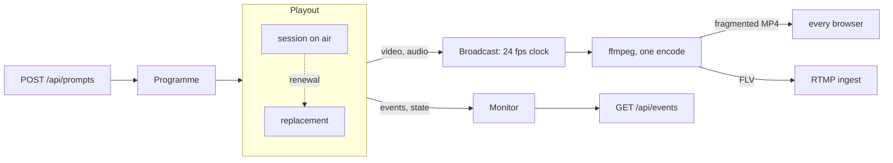

# Live channel

Your own 24/7 AI TV channel on Reactor's H3. Viewers send prompts, a house rotation fills the gaps, and sessions renew before their cap with no dark air. Any number of viewers watch one paid session, and the program can also go to Twitch, YouTube or X. It is a Node server of a few hundred lines with no headless browser: `reactor-effect-native` hands the server decoded frames and audio, and ffmpeg encodes them once.

The page shows the program with a LIVE badge, what is on air and who asked for it, what the playout has lined up next, the session on air with its cap and renewal countdown, and an as-run log of what aired and how each clip ended. A prompt that can't start in time is refused with how long to wait.

## Run it offline

Needs Node 22.18 or newer and `ffmpeg` on `PATH`. From the repository root:

```sh
bun install && bun run build
node examples/livestream/src/main.ts      # http://127.0.0.1:3000
```

Offline, the channel runs on `ReactorTest`, the SDK's simulated Reactor, at the timing paid H3 runs measured. It costs nothing. The scheduling, renewal and as-run reports are the real playout; the picture is the simulator's flat colour per clip with a tone. Sessions last two minutes, so the first renewal comes about 75 seconds in. `/docs` describes the API.

## Go live

```sh
CHANNEL_MODE=live REACTOR_API_KEY=rk_… node examples/livestream/src/main.ts
```

The API key stays on the server. Each session starts on a token the server mints for it, capped at `CHANNEL_SESSION_LENGTH` (10 minutes), and the playout opens its replacement 45 seconds before the cap. `CHANNEL_MAX_SESSIONS` (3) is how many sessions a run may open; after the last one's cap the channel goes off air. Live mode needs the native addon: npm ships it prebuilt for linux-x64 and darwin-arm64, and in this repository you build it first ([packages/native](../../packages/native/README.md)).

H3 costs $0.035 a second from `ready` until the session ends: $2.10 a minute, $126 an hour on air. Each renewal adds up to 45 seconds of a second session, about $1.58. With the defaults a run is at most three 10-minute sessions, $63. For a channel that runs all day, raise both settings: with 6-hour sessions, renewals add about $6 a day.

A crash can't run up an open-ended bill. Every session is created capped, so Reactor ends it by its cap whatever happens to the server (a paid probe saw a 60-second session ended 60.09 s after allocation: `integration/hosted/evidence/0.8.0-probe/summary.md`). A crash costs at most the two sessions open during a renewal, $42 at the defaults, and `allocations.jsonl` names each session before it connects. On Ctrl-C the server terminates its sessions and writes their close reports to `cleanup.jsonl`.

This example's live mode has not run on hosted Reactor. The playout it uses has: three 75-second sessions, a dropped connection and a moderated session, 20 clips with 53–169 ms seams and no dark frame (`integration/hosted/evidence/0.8.0-api/summary.md`).

## Restream to Twitch, YouTube or X

```sh
CHANNEL_RTMP_URL=rtmp://live.twitch.tv/app/<stream key> node examples/livestream/src/main.ts
```

Take the ingest URL and stream key from the platform's stream settings; the URL may be `rtmp://` or `rtmps://`. So far the restream has run only against a local `rtmp://` listener, not a platform's ingest. The encoder then runs whether or not a browser watches, and the same encode goes to the ingest as FLV. If the ingest refuses or drops the connection, ffmpeg connects again every 5 seconds and resumes at a keyframe; if it falls behind, it loses its own packets and the browsers never wait for it. The stream key is cut out of every log line. To try it offline, listen with ffmpeg and point the channel at it:

```sh
ffmpeg -listen 1 -i rtmp://127.0.0.1:1935/live/test -c copy out.flv &
CHANNEL_RTMP_URL=rtmp://127.0.0.1:1935/live/test node examples/livestream/src/main.ts
```

## Settings

| Variable                 | Default                        | Meaning                                                          |
| ------------------------ | ------------------------------ | ---------------------------------------------------------------- |
| `CHANNEL_MODE`           | `simulated`                    | `simulated` (offline, unpaid) or `live` (paid H3 sessions)       |
| `REACTOR_API_KEY`        |                                | Live only; stays on the server                                   |
| `REACTOR_API_URL`        | `https://api.reactor.inc`      | Live only                                                        |
| `CHANNEL_NAME`           | `Slow TV`                      | The name on the page                                             |
| `CHANNEL_SESSION_LENGTH` | `10 minutes` live, `2 minutes` | Each session's cap                                               |
| `CHANNEL_RENEWAL_LEAD`   | `45 seconds`                   | How long before the cap the replacement opens                    |
| `CHANNEL_CLIP_SECONDS`   | `8`                            | Every clip's length, within H3's 5 to 15.084 seconds             |
| `CHANNEL_MAX_SESSIONS`   | `3`                            | Live only; sessions a run may open                               |
| `CHANNEL_RTMP_URL`       |                                | An `rtmp://` or `rtmps://` ingest that also receives the program |
| `CHANNEL_EVIDENCE_DIR`   | `.channel`                     | Where `allocations.jsonl` and `cleanup.jsonl` are appended       |
| `HOST`, `PORT`           | `127.0.0.1`, `3000`            | Anyone who can reach the server can watch and send prompts       |

## How it works


```mermaid
flowchart LR
  P[POST /api/prompts] --> G[Programme] --> PO
  subgraph PO[Playout]
    S1[session on air] -.renewal.-> S2[replacement]
  end
  PO -- video, audio --> B[Broadcast: 24 fps clock] --> F[ffmpeg, one encode]
  F -- fragmented MP4 --> V[every browser]
  F -- FLV --> R[RTMP ingest]
  PO -- events, state --> M[Monitor] --> E[GET /api/events]
```

- **One `Playout`** (`src/Channel.ts`) holds a `viewer` lane for prompts and the house rotation as its `filler`, which keeps 8 to 16 seconds of air secured whenever no viewer has asked for anything.
- **Sessions** come from `H3Source.open`: it mints the session's token with `coordinator.tokens`, allocates, records the owner through `onAllocated`, and only then connects. Live, the connection runs on `NativePeer.layerIsolated()`, each peer in a child process of its own, so a crash in libwebrtc ends one connection, not the server. Offline the same code runs on `ReactorTest.layer`.
- **Renewal** is the playout's: `renewal.lead` before a session's cap it opens the replacement, builds new clips there, and switches the air at a clip boundary once the old session has played what it holds.
- **Admission** (`src/Programme.ts`): a prompt joins the end of the viewer lane, so it is taken only if the rest of the clip on air and the viewer prompts already lined up leave it room to start within the renewal lead less one clip. Otherwise the reply is `429` with `retryAfterSeconds`. The prompt goes in with a firm window, and the playout drops one that still can't start in time as `late`.
- **The broadcast** (`src/Broadcast.ts`) reads `playout.video` and `playout.audio`, which continue across renewals, and feeds ffmpeg a steady 24 frames a second. ffmpeg's tee muxer writes the one encode as fragmented MP4 for the browsers, which `Stream.share` fans out, and as FLV to the ingest.
- **The monitor** (`src/Monitor.ts`) folds `playout.events` into the as-run log and the sessions' history, and reads `playout.state` for what is on air and lined up. `GET /api/events` sends that status first and again at every change. A clip on air shows as "Starting" until the broadcast has received a frame after the session reported its start.

| File               | What it does                                                                    |
| ------------------ | ------------------------------------------------------------------------------- |
| `src/Api.ts`       | The `HttpApi` contract: prompts, the status and its event feed, the MP4 stream  |
| `src/Channel.ts`   | The playout over `H3Source`, live or on `ReactorTest`, and the house rotation   |
| `src/Programme.ts` | Viewers' prompts as keyed items with a firm window, and their refusals          |
| `src/Broadcast.ts` | The frame clock, the encoder, the fan-out to browsers and the ingest            |
| `src/Monitor.ts`   | What is on air, lined up and aired, and the sessions carrying it                |
| `src/Ledger.ts`    | Owner records and the cleanup report                                            |
| `src/Settings.ts`  | The settings above, checked before any session opens                            |
| `src/App.ts`       | The layers, built so that what fails for free fails before a paid session opens |

## Test

```sh
bun run check:examples     # from the root; or `npx vitest run` here
```

`test/livestream.test.ts` serves the whole channel offline with 30-second sessions and drives it through the typed client derived from `Api`: a prompt is taken and airs with its words, and a viewer's MP4 carries on across a session switch. `test/Broadcast.test.ts` changes the frame format under a viewer and checks that the next viewer gets a new encoder run. Both need ffmpeg and skip without it, except in CI.

## Limits

- **What a viewer sees is not proven.** A clip's start is the session's report, and the page waits for the broadcast to receive a frame after it; whether a viewer's screen showed it is their player's business.
- **The ingest's state is in the server log only.** ffmpeg reports a failed connection there; the page does not show the restream.
- **Prompts are public.** Anyone who can reach the server shares the channel; a real deployment authenticates viewers and moderates prompts before Reactor's own moderation does.
- **Clip failure reasons stay private.** An H3 `clip_failed` reason is provider text, so the as-run log says only `Failed · Clip`.
- **The encoder stops with its run.** Its input queues end before shutdown, and its writers belong to that run's scope. In this repository Bun patches the pinned Node process adapter (`patches/`) to keep input-pipe error listeners through teardown, so a pipe reset after writing ended cannot crash the channel. An application built from this example installs the unpatched adapter, where a reset at that moment can still end the process until Effect fixes it; ending the inputs first makes it rare. ffmpeg is killed with `SIGKILL`: it catches `SIGTERM` and can remain blocked reading an input pipe.
- **One picture format per encoder run.** A canvas change restarts the encoder and viewers reconnect. Audio is mixed down to 48 kHz mono.
- **Safari** can't play fragmented MP4 progressively from a `<video>` tag; it needs MSE or HLS in front of the same segments.
