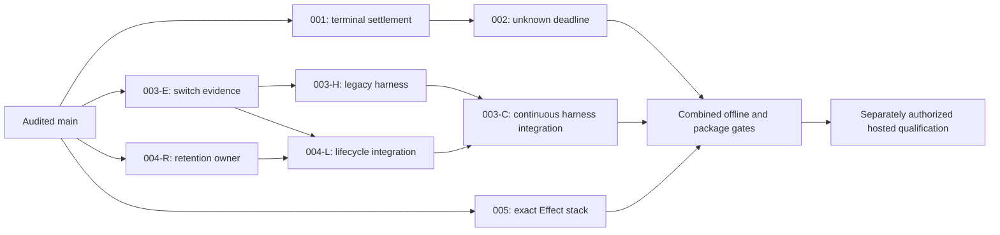

# Parallel execution of plans 001–005

Baseline: remote main `c47e50c784f6889b542cf8ee316067b688ca4737`, 2026-09-26. This schedule refines the five plans; it does not start implementation or change their product contracts. Read the relevant main plan and decision appendix before taking a packet. All packets below are TODO.

## Four workstreams

Start four independent workstreams from the audited baseline, reconciling current remote main first. Use a separate worktree/branch for each implementation stream. The planning checkout contains only planning documents; do not implement on its older `issue-31` source.

| Stream | First packet, ready now | Next packet | Actual dependency |
| --- | --- | --- | --- |
| A — scheduler | **001**: terminal settlement and immediate-close regressions | **002**: canonical recovery characterization, deadline and filler ledger | 002 production changes consume 001's completed terminal owner. Its read-only trace/test design can start earlier. |
| B — qualification | **003-E**: additive handoff evidence and deterministic source/policy tests | **003-H**: legacy public scheduler harness, clocks, attribution, evidence and budget guards | Actual harness integration needs the 003-E event contract/implementation; schema fixtures and budget tests can start against the written contract. It does not need completed 002 to be developed. |
| C — continuous renewal | **004-R**: API review and concrete bounded retention owner with fixtures | **004-L**: integrate retirement, private identities, continuous constructor and summary | 004-L consumes 004-R and the small 003-E change in shared renewal files. It does not wait for the whole hosted harness or normal 002 scheduler edits. |
| D — package tooling | **005**: locked Effect selection, clean consumers and retained identity metadata | Available for review or an independent remaining packet | No runtime-plan dependency. Its result is required for final package evidence, not to start any other implementation. |

After 003-E, **003-H and 004-L run in parallel**, as can 002 and 005 if still active. Then **003-C** adapts the harness to the real continuous API and verifies both constructors. An available worker may take a ready packet from another stream; stream names indicate file ownership, not a permanent person or a requirement to wait for an idle owner.

Arrows mean a real prerequisite for completion/integration, not a reason to postpone independent reading or fixtures. In particular, there is no blanket `002 → 003 → 004` dependency. All tested combined behavior still goes through the final join.

## Packet boundaries and handoffs

### 001 and 002 — one scheduler ownership chain

001 owns `scheduler.ts` and its terminalization regressions. Hand off a reviewed implementation commit, the terminal settlement entry point and scope/finalizer order, typed-versus-Cause outcome matrix, and passing immediate-close tests. That is an internal handoff, not a new public lifecycle API.

002 starts production changes from that commit and reuses the same terminal owner. Keep its additional unknown/deadline/canonical-recovery tests in `packages/client/test/orchestration/SchedulerUnknownRecovery.test.ts` when a separate file prevents overlap with other packets. Use the existing fixtures; do not fork fixture infrastructure or export private production hooks. Existing SchedulerFates/Core/Renewal suites remain regression gates. 002's option type and public-consumer assertions go through the shared-file integration owner below.

002 has **no planned renewal production change**. If characterization proves a defect requiring `renewal.ts` or `source-slot.ts`, isolate the finding and smallest patch, coordinate it with the current owner of those files, and update the dependency graph for that patch. Do not make all continuous work wait for a hypothetical defect, or make competing retirement changes silently.

### 003-E — small additive evidence slice

Own `packages/client/src/orchestration/{types,renewal-state,source-slot,renewal}.ts` only for the planned `Switched.handoff` evidence. Keep handoff behavior unchanged. Own its focused `RenewalState.test.ts`/`Media.test.ts` assertions. Avoid broader cleanup/retention refactoring in this packet.

Handoff: the actual optional handoff type, immutable capture point, old-value compatibility, and passing deterministic eligibility/evidence tests. Use branch `codex/qualify-switch-evidence`. Land/review this small slice independently of the hosted harness so C can base lifecycle integration on it. Any public-type/consumer hunk is handed to the designated shared-file owner; it is not duplicated across branches.

### 004-R — independent bounded retention owner

Review the proposed continuous API, identity precondition and summary shape in the 004 decision before building against them. That review is part of this packet, not a hidden requirement to ask for permission to begin analysis. Record changes to the written contract and notify its consumers before implementation depends on them.

Use the already contemplated concrete module `packages/client/src/orchestration/retention.ts` for reservations, classification, retained successes/incomplete rows and exact summary accounting; keep it independent of live Slot/Scope/media objects. Use existing canonical `SourceCleanup` data and narrowly scoped internal types. No new generic cache/service framework or dependency on an unimplemented constructor.

Own `packages/client/test/orchestration/Retention.test.ts`: exercise reservation-before-open, failed acquisition, incomplete cleanup, attached versus owned reports, success eviction, exact counts and exhaustion with room for outstanding owners. These are state-transition fixtures, not duplicated implementation assertions. Public summary schema and lifecycle adapters belong to 004-L; agree their data contract before both proceed. Do not create a second definition of the public Schema in the harness or a fake live constructor.

Verify 004-R from `packages/client` with `bun run test test/orchestration/Retention.test.ts --testTimeout=6000`; before handoff also run that file under the Node and Bun Vitest commands from plan 004. Handoff: reviewed private owner contract, ownership/bound invariants and passing fixtures. This code can be prepared and validated independently; it need not land as unused production code on main. Stack it with 004-L when that consumer is ready. Branch `codex/renewal-retention-core`.

### 004-L — renewal integration

Base on reviewed 003-E and 004-R. Now own `renewal.ts`, `source-slot.ts`, `types.ts`, `routing.ts` and `index.ts` for continuous mode. Own `RenewalRetention.test.ts` and required existing renewal/lifetime/media tests; core `Retention.test.ts` stays with 004-R until its handoff. Preserve 003-E evidence exactly and run its tests after each retirement integration change.

Implement the actual constructor/summary, completion Exit, identity fencing and bounded live/history ownership from 004. Keep the proposed public API/codec stable for the harness once reviewed. No scheduler-policy edits are expected. If a real scheduler contract dependency appears, stop that integration slice, record the exact dependency and coordinate with A; unrelated ledger/codec work can continue. Branch `codex/bound-renewal-retention`.

Handoff: real exported factory/types/codec, legacy compatibility and >64-renewal regressions, fixed source/report field definitions, and passing 003-E cases. This releases 003-C; it does not itself claim hosted qualification. The two-constructor hosted rehearsal is a final-join gate after 003-C, not a circular requirement for completing the 004-L packet.

### 003-H and 003-C — harness chain

003-H owns only `integration/hosted/{qualify,evidence,gates,collect,report}.ts`, required `twin/` behavior and hosted tests/docs from plan 003. Use `hosted-renewal.test.ts` for focused new fixtures. Work against legacy `make` and actual 003-E events. Budget, clock, attribution and malformed-evidence tests can be implemented before other runtime packets finish. Keep historical checks valid; no live spend.

Do not add a fake `makeContinuous`, cast a partial implementation to its future interface, or skip missing lifecycle evidence to get green tests. Until 004-L is available, continuous coverage is pending, not passing. A typed fixture for a proposed serialized shape is useful schema preparation, not proof of the real codec or constructor. Branch `codex/hosted-renewal-harness`.

003-C consumes 003-H and 004-L and owns the same harness files after handoff. Replace provisional fixture assumptions with the real summary codec; run the same scenario against both constructors and record the actual constructor. Reconcile independent per-allocation canonical reports with continuous compaction. Its branch may be based on both reviewed inputs; no paid check yet.

### 005 — independent qualification tooling

Own `scripts/pack.ts`, `scripts/pack-effect-stack.ts`, its fixture test, `scripts/README.md` and `release-tools/test/Candidate.test.mjs`. This does not own the `scripts/pack/*-consumer.mts` public API assertions. Preserve peer ranges and source/native identity. Handoff exact-stack fixtures, successful isolated-consumer evidence and identity-retention compatibility. Branch `codex/pin-qualification-stack`.

## Shared files and single-writer rules

Separate worktrees isolate edits and build output; they do not resolve contradictory contracts. Use these owners, and transfer ownership only at the stated handoff:

| Shared surface | Writer / sequence | Other streams do |
| --- | --- | --- |
| `scheduler.ts`, `scheduler-policy.ts`, SchedulerFates/Core tests | A: 001 then 002 | Consume the contract and run regressions. Request a focused hunk if needed. |
| `renewal.ts`, `source-slot.ts`, `types.ts` | B for 003-E, then C for 004-L | Wait only for that small source handoff; continue harness/ledger work. A's unexpected renewal patch must be coordinated. |
| `renewal-state.ts`, Media/RenewalState tests | B for 003-E; C takes any needed edits after handoff | Preserve the evidence tests through retention changes. |
| `retention.ts`, `Retention.test.ts` | C during 004-R, then C's lifecycle integrator | Consume the reviewed concrete owner; no duplicate ledger. |
| `SourceFixture.ts` | B during 003-E, then C during 004-L | Reuse existing hooks. If an indispensable fixture extension is needed, send one narrow patch to the owner or serialize that fixture-only commit. |
| `SchedulerRenewal.test.ts` | Final integration owner | A uses its focused unknown suite; C uses RenewalRetention; B uses focused evidence/hosted suites. Consolidate only genuinely shared end-to-end regressions at the join. |
| `PublicTypes.test.ts`, `scripts/pack/*-consumer.mts` | Designated integration owner, sequential per API handoff | Supply exact assertion hunks with each API packet. Integrate/test them before declaring the API packet complete; do not defer compatibility testing to after release. |
| Root/package READMEs, `CHANGELOG.md`, orchestration test README and plan index | Integration owner, serial edits per reviewed packet | Supply concise documentation hunks; no competing rewrites. Hosted docs belong to B; scripts docs belong to D. |

The integration owner can be one of the four workers when an input is ready; this is a responsibility, not a fifth standing workstream. Single-writer rules apply to mergeable edits. Independent read-only review, test execution in separate worktrees, and preparing proposed hunks remain parallel.

## Verification and join

Every packet runs its focused tests from its parent plan; each reviewable source/API change still satisfies repository build/typecheck/lint and relevant portable gates. Confirm patched Effect compiler, use Bun, no `any`, original defect Causes and scoped ownership. This schedule changes neither Effect mechanics nor the acceptance criteria.

- Run focused suites concurrently in **separate worktrees** when they have separate test outputs/resources. Run builds, native staging, integration bundles and pack generation sequentially within each worktree because they write `dist` and artifacts. Do not share a mutable staging directory or ledger between runs.
- A fixture-only precursor can pass before a later feature exists; report exactly what passed. Never disable future assertions or claim a combined scenario passed from isolated fixtures.
- At integration, record input SHAs and resolve shared-file hunks in the ownership order. Rerun tests affected by merge/conflict resolution, then one complete portable gate, both runtime suites required by these plans, offline hosted rehearsal for both constructors, release-tool checks and final full package/native CI on the combined revision.
- 005 is a dependency of final package evidence, not of harness implementation. If it finishes late, keep runtime work moving and repeat the package gate once the selected-stack change is integrated.
- The final hosted run waits for the combined gates, exact package/native identity and explicit paid authorization. Run the approved scenario once on those bytes. A successful earlier legacy run cannot qualify later continuous code.

An urgent bugfix checkpoint remains possible after 001/002/005 and their appropriate offline/package gates. It makes no continuous-mode or unrun hosted claims. Do not release, push or spend merely because this schedule identifies a checkpoint.

## Status handoff format

Each packet reports: branch and input SHAs; exact changed files; contract changes (or none); focused/full gates actually run and results; outstanding integration assertions; and the next owner. Update this document/index as READY, IN PROGRESS, READY FOR INTEGRATION, DONE or BLOCKED with a concrete dependency. Planning readiness, implementation completion, offline verification and hosted qualification remain separate.
