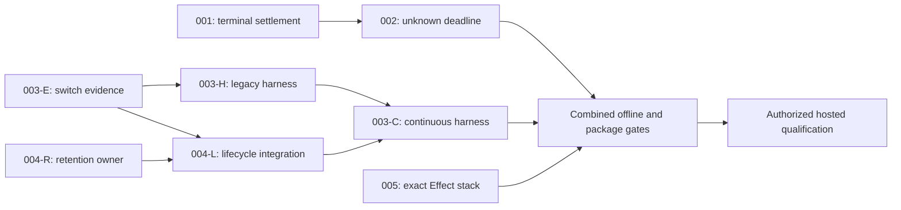

# Remaining work on remote main

Planned on 2026-09-26 against **`c47e50c784f6889b542cf8ee316067b688ca4737`**, the fetched `origin/main` and 0.5.0 release. The working checkout was `issue-31` at `df27245`; it was not used as the source baseline or changed. These plans reconcile open issues #31, #36 and #37 with the implementation, tests, release notes and current CI.

**Recommendation:** start four workstreams together: **A: 001 → 002**, **B: 003 switch evidence → hosted harness**, **C: 004 retention core → lifecycle integration**, and **D: 005 package tooling**. Only shared source ownership and real contract dependencies are serialized. See the [parallel execution guide](PARALLEL-EXECUTION.md) for exact packets, files, handoffs and branch boundaries.

Implementation tasks have now been dispatched: [task directory and integration ownership](WORKSTREAM-TASKS.md). The readiness table below is the planning baseline; use the task handoffs for current implementation/test status.

## Parallel work and readiness

| Stream / packet | Work | Start condition | Planning / implementation status |
| --- | --- | --- | --- |
| A / [001](001-settle-before-scheduler-failure.md) | Settle handles before scheduler failure (#36) | Ready now | Regression-first design ready / TODO |
| A / [002](002-bound-unknown-admission.md) | Verify recovery; bound unresolved admission (#37) | Trace/test design now; production after 001 | Concrete proposed policy / TODO |
| B / [003-E](003-qualify-public-scheduler-renewal.md) | Add switch evidence and deterministic tests | Ready now; no scheduler-fix dependency | Concrete evidence contract / TODO |
| B / 003-H | Build public legacy scheduler/renewal harness | Schema/budget fixtures now; actual integration after 003-E | Concrete scenario contract / TODO |
| C / [004-R](004-bound-live-renewal-state.md) | Review API and build bounded retention owner/fixtures | Ready now; independent of harness | Proposed API review checkpoint / TODO |
| C / 004-L | Integrate continuous lifecycle and summary | 004-R plus small 003-E source handoff | Concrete proposed design / TODO |
| D / [005](005-reproducible-effect-qualification.md) | Qualify exact locked Effect stack | Ready now | Concrete stack contract / TODO |
| 003-C | Adapt harness to real continuous constructor/summary | 003-H and 004-L | TODO |
| Final join | Combined offline/package gates, then authorized hosted run | 002, 003-C and 005 integrated | Hosted NOT AUTHORIZED / NOT RUN |

Original priorities/estimates remain: 001 P1/S–M/medium risk; 002 P1/M–L/high risk; 003 P2/M/medium risk; 004 P2/L/high risk; 005 P2/S–M/low risk. S is hours, M approximately a day, L multiple days including review; these are estimates. Decision appendices accompany [002](002-unknown-capacity-decision.md), [003](003-qualification-contract.md), [004](004-renewal-retention-decision.md) and [005](005-effect-stack-contract.md).

001, 003-E, 004-R and 005 start together. After the small evidence handoff, 003-H and 004-L run concurrently. 002 proceeds alongside them after 001. Do not make 003-E wait for scheduler fixes, 004-R wait for the harness, or runtime implementation wait for 005. These were unnecessary whole-plan dependencies in the earlier sequence.

Use isolated worktrees. One owner edits scheduler files through 001/002; renewal/source-slot/type ownership transfers from 003-E to 004-L. A reproduced 002 renewal defect gets a coordinated narrow patch, not a blanket block on 004. Shared fixtures, type consumers and documentation have single-writer rules in the execution guide. Serialize build/pack writes within each checkout; final gates run on one integrated revision.

The paid check remains last and qualifies exact tested bytes. An urgent bugfix checkpoint can stop after 001/002/005 and their relevant offline/package gates, with continuous mode and unrun hosted checks explicitly absent from its claims. No implementation, worktrees, PRs, release or paid run is started by this planning update.

## Decisions across the path

| Boundary | Proposed decision | Evidence required before completion |
| --- | --- | --- |
| Failure notification | 001 owns one terminal claim and joinable local settlement; publishes failure last | Immediate supervisor-close tests, typed failures and original defect Causes, parallel parent scope |
| Unknown admission | Keep strict capacity and existing Renewal replacement; default 60-second scheduler deadline (finite override up to 10 minutes) | Canonical hook-to-replacement trace plus generic/stalled-owner timeout regressions; no replay or fake rejection |
| Cleanup versus service | Scheduler waiter settlement can be bounded without asserting source cleanup is finished | Blocked-close fixture; original cleanup remains owned and inspectable |
| Switch qualification | Retain provider calibration; add a separately discriminated public scheduler/renewal check and final-clip evidence | Schema gates, real process-timer loopback, final authorized hosted ledger |
| Continuous mode | Separate opt-in factory/summary; legacy complete reports and lifetime cap unchanged | Numeric retention and reservation bounds; cleanup predicate; explicit source-identity precondition and private incarnation fences |
| Effect stack | Qualify exact frozen installed versions while preserving public peer ranges | Independent resolver fixtures, clean installed consumers, retained exact-stack metadata and release identity compatibility |

Plan 004's API review must acknowledge its explicit adapter contract: globally unique physical source IDs cannot be fully checked forever with bounded local memory. The recommended opt-in design requires that uniqueness and detects live collisions, while private incarnation fences protect retained operations. Legacy construction keeps today's full historical check. If that tradeoff is unacceptable, defer continuous mode and separately design reference-bearing public operations; do not smuggle in unbounded tombstones or claim equivalent historical misuse detection.

Each executor must carry forward four distinct statuses: design accepted, implemented, offline verified, hosted qualified. A passing simulation is not a paid-provider result; a settled scheduler is not a remotely confirmed cleanup; a fresh source snapshot is not an admission barrier.

## Vetted findings

Source locations below refer to the stamped remote-main commit, not the older local checkout. Source findings below are confirmed by inspection. Their impact is limited to the paths named; proposed changes still need regression-first implementation and the plan-specific gates.

| Finding | Impact | Evidence on `c47e50c` | Disposition |
| --- | --- | --- | --- |
| Failure is published before shutdown bookkeeping finishes | A consumer closing the scope on `scheduler.failure` can leave item handles pending forever | `scheduler.ts:664–684`, `:1815–1828`; `SchedulerFates.test.ts:511–546` gives settlement 100 ms before checking it | 001; [#36](https://github.com/mannyc2/reactor-effect-client/issues/36) |
| Unknown dispatch can occupy generic Engine capacity indefinitely | At the default cap, later work stalls without evidence/retirement; canonical Renewal already requests replacement and needs a full progress regression | `scheduler-policy.ts:255–266`, `:285–294`; `scheduler.ts:525`, `:1296–1303`, `:1344–1349`; existing recovery `renewal.ts:750–787` | 002; [#37](https://github.com/mannyc2/reactor-effect-client/issues/37) |
| Clean consumers install ranges but validation expects the range minimum | A later compatible Effect RC can break package qualification without a repository change | `scripts/pack.ts:133–140`, `:457–482`, `:778–817` | 005; latent defect, current CI passes |
| Hosted scheduler check bypasses scheduler and renewing orchestration | A pass cannot establish public renewal ordering, drain, or final-clip grace behavior | `integration/hosted/qualify.ts:969–1038` directly stops/starts providers | 003; existing provider-facts check remains useful |
| Switch evidence merges final-clip loss into session totals | Consumers cannot identify grace expiry versus older loss | `source-slot.ts:314–317`, `:355–367`; `types.ts:253–258`; `renewal.ts:1101–1123` | Additive evidence slice in 003 |
| `maxSessions` caps lifetime openings and retains closed state | Healthy long-running orchestrations eventually stop renewing; increasing the cap also increases retention | `renewal.ts:181–185`, `:273–276`, `:486–490`, `:537–538`, `:618` | 004; documented existing bound, product limitation rather than an accidental off-by-one |
| Qualification documentation is stale | Maintainers could repeat a paid audio check already completed | Root `README.md:13` vs `integration/hosted/evidence/0.3.1/summary.md:3`; `scripts/README.md:41` says rc.115 | Fold into 003/005 |

Unqualified names in the table live under `packages/client/src/orchestration/`; tests under `packages/client/test/orchestration/`.

## Reconcile #31 instead of reopening completed work

[The original scheduling plan](https://github.com/mannyc2/reactor-effect-client/issues/31#issuecomment-5837182744) was largely delivered in [PR #34](https://github.com/mannyc2/reactor-effect-client/pull/34), followed by the 0.5.0 release. The following are already present:

- Source-local ordering, source-fenced enqueue, affinity rejection in scheduler requests.
- Keyed scheduler, lineup preset, lanes, seconds-based runway, windows, `At` starts and as-run handles.
- Monotonic elapsed timing, retained first-decisive evidence, and conservative unknown outcomes.
- Drains, including filler continuity while accepted items are still building.
- Final-clip handoff with bounded grace; historical frame loss no longer holds every planned switch until session expiry.
- Per-frame and per-audio-block arrival arrays and a budgeted two-session provider-facts harness.
- 0.5.0 publication. Release/publish is not unfinished work.

Remaining #31 closure evidence is: actual public scheduler/renewal qualification; the outstanding resume qualification; verification of the paired the-show migration and its container gate in that repository. The latter is not established by this audit. Track 004 as an explicit follow-up if it should not block closing the original scheduler delivery issue. Any issue updates must use evidence from the implementing PR; this planning task posted no comments or new issues.

## Considered and rejected / deferred

- **Add a new public recovery API because canonical Renewal has none:** rejected after tracing the existing result hook and replacement path. The scripted-Engine report does not demonstrate absence of canonical recovery.
- **Remove `Unknown` from `inflight`, raise the default cap, or replay an absent key:** these do not establish remote capacity or safe replay. A newer local snapshot is not a provider dispatch barrier. See 002.
- **Immediately complete every unknown drain:** uncertainty is not evidence of rejection, withdrawal, or playback. Preserve honest outcomes; a bounded abort/retirement path is a distinct contract.
- **Simply remove `opened` or prune all old cleanup:** this trades the lifetime stop for unbounded memory or erased cleanup obligations. See 004.
- **Fold every recovery defect into a generic operational failure:** rejected. Plan 002 characterizes the unsupervised recovery-fiber defect path and bounds scheduler service; direct Engine/media all-cause supervision remains a separate scoped follow-up if reproduced. Preserve the original Cause.
- **Rewrite the scheduler architecture first:** no evidence that a broad refactor is needed before the two concrete regressions. Keep fixes narrowly reviewable.
- **Build verification infrastructure:** unnecessary. Exact-main CI already passes seven jobs, including portable checks, runtime matrix, native qualification and pack/install.
- **Redo frame-arrival collection or implement `At`:** both already shipped.
- **Multi-part items, secondary events, immediate cuts, or durable scheduling:** defer until a consumer requires them; they are direction options, not blockers for these bugs.

## Verification baseline and limits

[CI run 36223885202](https://github.com/mannyc2/reactor-effect-client/actions/runs/36223885202) passed on the exact audited SHA. This is existing remote evidence, not a claim that these new regressions pass. No local build, test suite, installation, native compilation or paid provider session was run for this documentation-only audit.

Executors must use Bun, avoid `any`, and omit AI attribution in commits. Read `CONTRIBUTING.md` and `scripts/README.md`. The user-referenced `docs/Codex/comments.md` and `docs/Codex/file-structure.md` are absent from both the remote tree and this checkout; use the supplied conventions (comments explain why, feature-local organization, relative local imports), and read those files if restored before execution. Each plan states its own scope and commands.

Coverage was weighted toward the open backlog: scheduler/renewal, their tests, hosted evidence and package qualification. This was not an exhaustive native Rust, browser, protocol/security, dependency-advisory, or performance audit. No vulnerability-free claim is made. the-show, hosted Reactor behavior, billing, encoded output and viewer presentation were not independently verified.

Update statuses to IN PROGRESS, DONE, BLOCKED with a reason, or REJECTED with a reason. Keep design acceptance, implementation completion, offline verification and hosted qualification separate. Remote main was rechecked during this refinement and remained `c47e50c784f6889b542cf8ee316067b688ca4737`.
